# Basic-project-structure

一个通用的基础架构示例

## 基本项目构成

```mermaid
graph TD
    center(["应用服务中心\n项目后端，负责提供 api、rpc 等服务"])
        center --go 服务端--- center-go
        center --php 服务端--- center-php
        center --java 服务端--- center-java

    sdk.
        sdk.(["项目开发工具包\n脚手架、后端生成的开放文件"]) --- sdk

    manager.
        manager.([端管理后台]) --- manager

    client(["客户端"])
        client --H5 客户端--- client-mobile
        client --Android 客户端--- clientAndroid[client-android]
        client --iOS 客户端--- clientIOS[client-ios]
        client --Flutter 客户端--- clientFlutter[client-flutter]
```

<!-- https://mermaid.js.org/ -->

<!--

**Here are some ideas to get you started:**

🙋‍♀️ A short introduction - what is your organization all about?
🌈 Contribution guidelines - how can the community get involved?
👩‍💻 Useful resources - where can the community find your docs? Is there anything else the community should know?
🍿 Fun facts - what does your team eat for breakfast?
🧙 Remember, you can do mighty things with the power of [Markdown](https://docs.github.com/github/writing-on-github/getting-started-with-writing-and-formatting-on-github/basic-writing-and-formatting-syntax)
-->
